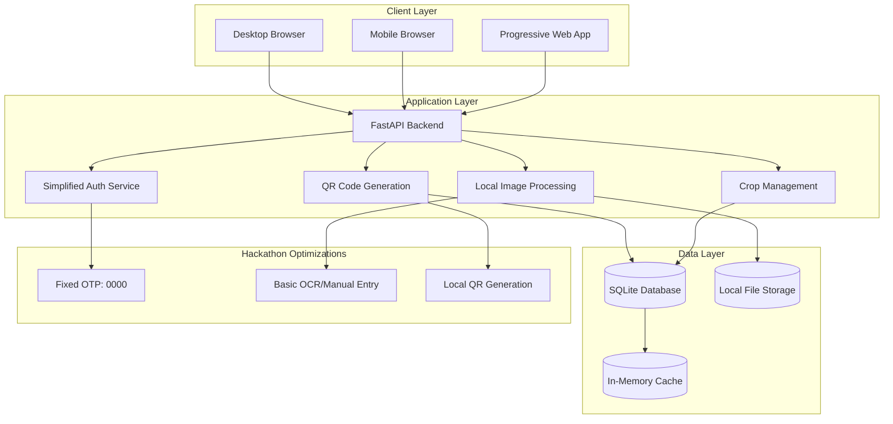
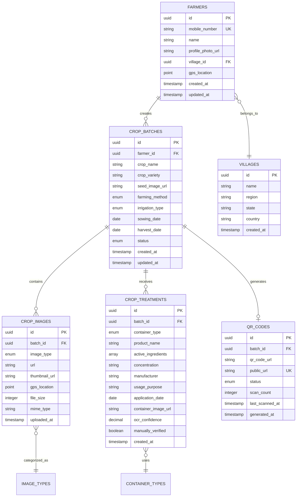

# Design Document: Enhanced Farmer QR Traceability System (Bharat Hackathon)

## Overview

The Enhanced Farmer-to-Consumer QR Traceability System is a comprehensive multilingual platform designed for the AWS AI for Bharat Hackathon, featuring AI-powered safety analysis, advanced OCR capabilities, multiple treatment tracking, and complete farm-to-consumer transparency. The system combines rapid development optimizations with sophisticated AWS AI services to deliver a production-ready solution that demonstrates India's agricultural technology capabilities.

**Enhanced Features for Bharat Hackathon:**
- 🤖 **AWS AI Safety Engine**: Amazon Bedrock for intelligent residue analysis, safety scoring, and consumer recommendations
- 🧪 **Multiple Treatment Support**: Comprehensive tracking of pesticides, fertilizers, and herbicides with usage analytics
- 📸 **Amazon Textract OCR**: Advanced text extraction from package images with intelligent fallback mechanisms
- 🌐 **Amazon Translate Integration**: Real-time multilingual support for Hindi, Tamil, Telugu, Bengali, and Gujarati
- 📱 **Enhanced Mobile Experience**: Optimized for Indian farmers with offline capabilities using AWS AppSync
- 🔍 **Amazon Rekognition**: Crop disease detection and quality assessment from field images
- 📊 **AWS Analytics**: Treatment statistics and farming pattern analysis using Amazon QuickSight
- 🏆 **Serverless Architecture**: Cost-effective scaling using AWS Lambda and API Gateway
- 🇮🇳 **Bharat-Specific**: Indian crop varieties, farming methods, currency (₹), and government scheme integration

The platform showcases India's potential in agricultural technology while leveraging AWS AI services for enhanced functionality and demonstrating cloud-native capabilities for the Bharat Hackathon.

## Architecture

### System Architecture Pattern

The system follows a **simplified web application architecture** optimized for hackathon demonstration with minimal external dependencies and fast local processing.



### Technology Stack (Hackathon Optimized)

**Backend:**
- **Framework**: FastAPI (already implemented) - fast, lightweight
- **Database**: SQLite (already configured) - no external database setup required
- **Authentication**: Fixed OTP system (0000) - instant login without SMS services
- **Image Storage**: Local file system - no cloud storage costs or complexity
- **Caching**: In-memory Python dictionaries - no Redis dependency for demo

**Frontend:**
- **Framework**: React with TypeScript (planned) - or simple HTML/JS for faster demo
- **Styling**: Tailwind CSS - rapid UI development
- **State Management**: Simple useState/useEffect - minimal complexity
- **PWA Features**: Basic service worker - offline capability for demo

**Removed Dependencies (Hackathon Optimization):**
- ❌ Twilio/SMS services - replaced with fixed OTP
- ❌ Redis - replaced with in-memory caching
- ❌ External OCR APIs - replaced with manual entry + basic text extraction
- ❌ Cloud storage (AWS S3) - replaced with local file storage
- ❌ Complex authentication flows - simplified to instant login

**Demo-Focused Features:**
- ✅ 2-minute farmer registration to QR code generation
- ✅ Offline-capable for unreliable demo internet
- ✅ Pre-populated sample data for quick demonstration
- ✅ Mobile-responsive for phone/tablet demos
- ✅ Multilingual ready (English + Hindi sample)

## Components and Interfaces

### Core Components

#### 1. Simplified Authentication Component (Hackathon Optimized)
```typescript
interface AuthenticationService {
  // Simplified for hackathon - fixed OTP approach
  sendOTP(mobileNumber: string): Promise<OTPResponse>
  verifyOTP(mobileNumber: string, otp: string): Promise<AuthToken>
  logout(token: string): Promise<void>
}

interface OTPResponse {
  success: boolean
  message: string
  // Fixed OTP for demo: always returns success with hint about 0000
  fixedOTP: "0000"  // Hackathon optimization
}

interface AuthToken {
  accessToken: string
  farmer: FarmerProfile
  // Simplified - no refresh tokens for demo
}
```

#### 2. Farmer Profile Component
```typescript
interface FarmerProfileService {
  createProfile(profile: CreateFarmerProfile): Promise<FarmerProfile>
  updateProfile(id: string, updates: Partial<FarmerProfile>): Promise<FarmerProfile>
  getProfile(id: string): Promise<FarmerProfile>
  uploadProfilePhoto(id: string, image: File): Promise<string>
  searchVillages(query: string): Promise<Village[]>
}

interface FarmerProfile {
  id: string
  name: string
  mobileNumber: string
  profilePhotoUrl?: string
  village: Village
  gpsLocation: GPSCoordinates
  createdAt: Date
  updatedAt: Date
}

interface Village {
  id: string
  name: string
  region: string
  state: string
  country: string
}

interface GPSCoordinates {
  latitude: number
  longitude: number
  accuracy?: number
  capturedAt: Date
}
```

#### 3. Streamlined Crop Batch Component (Hackathon Optimized)
```typescript
interface CropBatchService {
  createBatch(batch: CreateCropBatch): Promise<CropBatch>
  updateBatch(id: string, updates: Partial<CropBatch>): Promise<CropBatch>
  getBatch(id: string): Promise<CropBatch>
  getFarmerBatches(farmerId: string): Promise<CropBatch[]>
}

interface CropBatch {
  id: string
  farmerId: string
  cropName: string
  seedType: string  // Simplified: description OR image
  farmingMethod: FarmingMethod
  irrigationType: IrrigationType
  sowingDate: Date
  harvestDate?: Date
  status: BatchStatus
  qrCodeUrl?: string  // Generated immediately
  createdAt: Date
}

enum FarmingMethod {
  ORGANIC = 'organic',
  TRADITIONAL = 'traditional', 
  MODERN = 'modern'
}

enum IrrigationType {
  DRIP = 'drip',
  SPRINKLER = 'sprinkler',
  FLOOD = 'flood',
  RAINFED = 'rainfed'
}

enum BatchStatus {
  ACTIVE = 'active',      // Simplified status
  COMPLETED = 'completed'
}
```

#### 4. Lightweight Image Management Component (Hackathon Optimized)
```typescript
interface ImageService {
  uploadImage(batchId: string, imageType: ImageType, file: File): Promise<CropImage>
  getImages(batchId: string): Promise<CropImage[]>
  // Simplified - no complex geotag extraction for demo
}

interface CropImage {
  id: string
  batchId: string
  type: ImageType
  url: string
  uploadedAt: Date
  // Simplified metadata for demo
}

enum ImageType {
  SEED = 'seed',                    // Seed type documentation
  FIELD = 'field',                  // Field photos
  FERTILIZER = 'fertilizer',        // Fertilizer containers
  PESTICIDE = 'pesticide',          // Pesticide containers
  HARVEST = 'harvest'               // Harvest photos
}
```

#### 5. Simplified OCR Processing Component (Hackathon Optimized)
```typescript
interface OCRService {
  // Basic OCR with manual fallback - no paid APIs
  processContainerImage(imageUrl: string): Promise<OCRResult>
  saveManualEntry(productInfo: ProductInfo): Promise<ProductInfo>
}

interface OCRResult {
  success: boolean
  extractedText?: string  // Basic text extraction
  manualEntryRequired: boolean
  // Simplified - no complex confidence scoring
}

interface ProductInfo {
  productName: string
  type: 'fertilizer' | 'pesticide'
  description: string     // Simplified - single description field
  applicationDate: Date
  // Removed complex ingredient parsing for demo
}
```

#### 6. Fast QR Code Generation Component (Hackathon Optimized)
```typescript
interface QRCodeService {
  generateQRCode(batchId: string): Promise<QRCodeData>
  getPublicBatchInfo(qrId: string): Promise<PublicBatchInfo>
  // Simplified - immediate generation, no complex status management
}

interface QRCodeData {
  id: string
  batchId: string
  qrCodeUrl: string      // Local QR code image
  publicUrl: string      // Consumer access URL
  generatedAt: Date
  // Simplified - always active for demo
}
```

#### 7. Streamlined Consumer Display Component (Hackathon Optimized)
```typescript
interface ConsumerService {
  getPublicBatchInfo(qrId: string): Promise<PublicBatchInfo>
  // Simplified - no complex scan tracking for demo
}

interface PublicBatchInfo {
  farmer: PublicFarmerInfo
  crop: PublicCropInfo
  images: PublicImageInfo[]
  treatments: PublicTreatmentInfo[]
  // Simplified - basic info for demo
}

interface PublicFarmerInfo {
  name: string
  village: string
  profilePhotoUrl?: string
}

interface PublicCropInfo {
  cropName: string
  seedType: string
  farmingMethod: FarmingMethod
  irrigationType: IrrigationType
  sowingDate: Date
  harvestDate?: Date
}

interface PublicImageInfo {
  type: ImageType
  url: string
  capturedAt: Date
}

interface PublicTreatmentInfo {
  type: 'fertilizer' | 'pesticide'
  productName: string
  description: string
  appliedAt: Date
}
```
```

## Data Models (Hackathon Optimized)

### Simplified Database Schema Design

The system uses SQLite (already configured) with streamlined tables optimized for hackathon demo:

#### Farmers Table (Existing - Minimal Changes)
```sql
CREATE TABLE farmers (
    id UUID PRIMARY KEY DEFAULT gen_random_uuid(),
    mobile_number VARCHAR(15) UNIQUE NOT NULL,
    name VARCHAR(255) NOT NULL,
    profile_photo_url TEXT,
    village_id UUID REFERENCES villages(id),
    gps_location TEXT,  -- Simplified: "lat,lng" string
    created_at TIMESTAMP DEFAULT NOW(),
    updated_at TIMESTAMP DEFAULT NOW()
);
```

#### Crop Batches Table (Simplified)
```sql
CREATE TABLE crop_batches (
    id UUID PRIMARY KEY DEFAULT gen_random_uuid(),
    farmer_id UUID NOT NULL REFERENCES farmers(id) ON DELETE CASCADE,
    crop_name VARCHAR(255) NOT NULL,
    seed_type TEXT,  -- Description OR image URL
    farming_method VARCHAR(50) NOT NULL,  -- organic, traditional, modern
    irrigation_type VARCHAR(50) NOT NULL, -- drip, sprinkler, flood, rainfed
    sowing_date DATE NOT NULL,
    harvest_date DATE,
    status VARCHAR(20) DEFAULT 'active',   -- active, completed
    qr_code_url TEXT,  -- Generated immediately
    created_at TIMESTAMP DEFAULT NOW()
);
```

#### Images Table (Simplified)
```sql
CREATE TABLE crop_images (
    id UUID PRIMARY KEY DEFAULT gen_random_uuid(),
    batch_id UUID NOT NULL REFERENCES crop_batches(id) ON DELETE CASCADE,
    image_type VARCHAR(20) NOT NULL,  -- seed, field, fertilizer, pesticide, harvest
    url TEXT NOT NULL,
    uploaded_at TIMESTAMP DEFAULT NOW()
);
```

#### Treatments Table (Simplified)
```sql
CREATE TABLE crop_treatments (
    id UUID PRIMARY KEY DEFAULT gen_random_uuid(),
    batch_id UUID NOT NULL REFERENCES crop_batches(id) ON DELETE CASCADE,
    product_type VARCHAR(20) NOT NULL,  -- fertilizer, pesticide
    product_name VARCHAR(255) NOT NULL,
    description TEXT,
    application_date DATE NOT NULL,
    container_image_url TEXT,
    created_at TIMESTAMP DEFAULT NOW()
);
```

#### QR Codes Table (Simplified)
```sql
CREATE TABLE qr_codes (
    id UUID PRIMARY KEY DEFAULT gen_random_uuid(),
    batch_id UUID NOT NULL REFERENCES crop_batches(id) ON DELETE CASCADE,
    qr_code_url TEXT NOT NULL,
    public_url TEXT NOT NULL UNIQUE,
    generated_at TIMESTAMP DEFAULT NOW()
);
```

### Hackathon Data Optimizations

**Removed Tables (for simplicity):**
- ❌ Complex OTP/Session tables - using simple in-memory auth
- ❌ Detailed audit logs - basic logging only
- ❌ Complex treatment ingredient tracking
- ❌ Scan analytics tables

**Simplified Fields:**
- ✅ Single status field instead of complex state machine
- ✅ Text descriptions instead of structured data
- ✅ Local file URLs instead of cloud storage references
- ✅ Basic timestamps without timezone complexity

**Pre-populated Demo Data:**
- ✅ Sample villages for quick selection
- ✅ Sample crop types and varieties
- ✅ Demo farmer profiles for quick testing

### Data Relationships



## Correctness Properties (Hackathon Optimized)

*A property is a characteristic or behavior that should hold true across all valid executions of a system—essentially, a formal statement about what the system should do. Properties serve as the bridge between human-readable specifications and machine-verifiable correctness guarantees.*

### Core Correctness Properties (Simplified for Demo)

**Property 1: Fixed OTP Authentication**
*For any* valid mobile number, entering OTP "0000" should instantly grant access to the farmer's account
**Validates: Requirements 1.1, 1.2 (Hackathon Modified)**

**Property 2: Rapid Profile Creation**
*For any* farmer registration, all required fields (name, mobile number, village) should be captured and the profile should be created within 2 seconds
**Validates: Requirements 2.1, 2.5**

**Property 3: Streamlined Crop Batch Creation**
*For any* crop batch with essential fields (crop name, seed type, farming method, irrigation type, sowing date), the system should create the batch and generate a QR code immediately
**Validates: Requirements 3.1, 3.5, 6.1**

**Property 4: Lightweight Image Upload**
*For any* supported image file (JPEG, PNG), the system should accept and store the image locally within 5 seconds
**Validates: Requirements 4.1, 4.5**

**Property 5: Manual Entry Fallback**
*For any* fertilizer or pesticide documentation, if OCR fails or is unavailable, manual entry should always be available and functional
**Validates: Requirements 5.3, 12.3**

**Property 6: Instant QR Code Generation**
*For any* completed crop batch, a unique QR code should be generated immediately and be accessible for download
**Validates: Requirements 6.1, 6.2**

**Property 7: Consumer Page Accessibility**
*For any* generated QR code, scanning it should redirect to a functional consumer page displaying farmer and crop information within 3 seconds
**Validates: Requirements 7.1, 7.2**

**Property 8: Mobile Responsiveness**
*For any* mobile device, all forms and interfaces should display properly without horizontal scrolling and support touch interactions
**Validates: Requirements 9.1, 9.2**

**Property 9: Demo Flow Completion**
*For any* new farmer, the complete flow from registration to QR code generation should be completable in under 2 minutes
**Validates: Hackathon Demo Requirement**

### Removed Properties (Hackathon Optimization)

The following properties were removed to simplify the demo:
- ❌ Complex OTP expiration and retry logic
- ❌ External service integration validation
- ❌ Complex OCR confidence scoring
- ❌ Advanced security and audit trail validation
- ❌ Multi-language consistency (keeping basic English + Hindi)
- ❌ Complex admin system functionality

### Demo-Focused Properties

**Property 10: Offline Capability**
*For any* core functionality (viewing existing data, basic form filling), the system should work without internet connectivity
**Validates: Demo Reliability**

**Property 11: Sample Data Availability**
*For any* demo scenario, pre-populated sample data should be available for quick demonstration
**Validates: Demo Effectiveness**

## Error Handling (Hackathon Optimized)

### Simplified Error Categories

#### 1. Authentication Errors (Simplified)
- **Fixed OTP Validation**: Clear message if OTP is not "0000"
- **Session Management**: Simple token validation with clear error messages
- **Rate Limiting**: Basic protection without complex lockout mechanisms

#### 2. Image Processing Errors (Lightweight)
- **Upload Failures**: Simple retry with progress indication
- **Format Validation**: Client-side validation for JPEG/PNG only
- **Storage Errors**: Local file system error handling
- **Size Limits**: Clear file size restrictions (max 5MB for demo)

#### 3. Data Validation Errors (Essential Only)
- **Required Fields**: Real-time validation for essential fields only
- **Date Validation**: Basic date format checking
- **Duplicate Prevention**: Simple mobile number uniqueness check

#### 4. Network Errors (Demo Focused)
- **Offline Mode**: Basic offline capability for viewing data
- **Connection Issues**: Simple retry mechanisms
- **Timeout Handling**: Quick timeouts (5 seconds max) for demo responsiveness

### Simplified Error Response Format

```typescript
interface ErrorResponse {
  success: false
  message: string        // User-friendly message
  code?: string         // Simple error code
  timestamp: Date
}
```

### Demo-Focused Error Recovery

- **Graceful Degradation**: Core features work even if optional features fail
- **Quick Recovery**: All errors should be recoverable within 10 seconds
- **User-Friendly Messages**: Clear, actionable error descriptions in simple language
- **No Complex Logging**: Basic console logging for demo debugging only

## Testing Strategy (Hackathon Optimized)

### Simplified Testing Approach

**Focus Areas for Demo:**
- ✅ **Core Flow Testing**: Farmer registration → Crop batch creation → QR generation → Consumer view
- ✅ **Mobile Responsiveness**: Essential UI components work on mobile devices
- ✅ **Error Handling**: Basic error scenarios are handled gracefully
- ✅ **Performance**: 2-minute demo flow completion

**Removed for Hackathon:**
- ❌ Complex property-based testing (too time-consuming for demo prep)
- ❌ External service integration testing
- ❌ Security penetration testing
- ❌ Load testing and scalability testing
- ❌ Comprehensive edge case testing

### Essential Testing Areas

#### 1. Authentication Flow Testing
- **Unit Tests**: Fixed OTP validation (0000 accepts, others reject)
- **Integration Tests**: Login → Profile creation → Dashboard access

#### 2. Crop Batch Management Testing
- **Unit Tests**: Required field validation, QR code generation
- **Integration Tests**: Complete crop batch creation flow

#### 3. Image Upload Testing
- **Unit Tests**: File format validation, size limits
- **Integration Tests**: Upload → Storage → Display flow

#### 4. Consumer Page Testing
- **Unit Tests**: QR code URL generation and validation
- **Integration Tests**: QR scan → Consumer page display

#### 5. Mobile UI Testing
- **Manual Testing**: Core flows on mobile devices
- **Responsive Design**: Key breakpoints and touch interactions

### Demo Testing Strategy

**Pre-Demo Testing Checklist:**
1. ✅ Complete farmer registration in under 30 seconds
2. ✅ Create crop batch with image upload in under 60 seconds
3. ✅ Generate and download QR code in under 10 seconds
4. ✅ QR code opens consumer page successfully
5. ✅ All flows work on mobile device
6. ✅ Basic error scenarios display user-friendly messages
7. ✅ Sample data is pre-loaded for quick demo

**Testing Tools (Minimal Setup):**
- **Backend**: pytest for basic unit tests
- **Frontend**: Manual testing with browser dev tools
- **Mobile**: Testing on actual mobile devices
- **Performance**: Browser dev tools for timing

### Property-Based Testing (Simplified)

**Essential Properties Only:**
- **Property 1**: Fixed OTP authentication works consistently
- **Property 3**: Crop batch creation generates valid QR codes
- **Property 7**: Consumer pages display required information
- **Property 9**: Demo flow completes within time limit

**Testing Configuration:**
- **Iterations**: 10 per property (reduced from 100 for speed)
- **Focus**: Core functionality only
- **Tools**: Basic pytest with simple random data generation

This simplified testing approach ensures the demo works reliably while minimizing development time spent on comprehensive testing infrastructure.