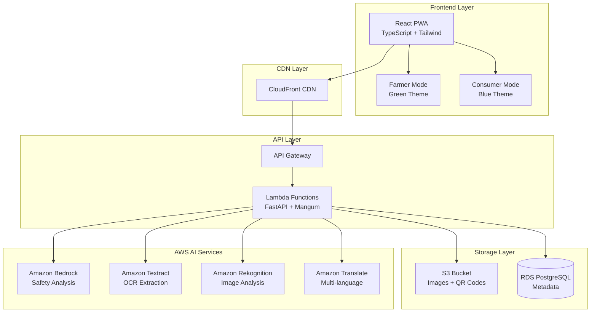

# Design Document: FARM2FORK AI-Powered Traceability Platform

## Overview

FARM2FORK is a production-ready, AWS-native platform that bridges the trust gap between farmers and consumers through AI-powered food traceability. The system uses QR codes as the linking mechanism, with two distinct user experiences: Farmer Mode (green-themed, data creation) and Consumer Mode (blue-themed, trust verification).

The platform leverages four AWS AI services:
- **Amazon Bedrock**: Generates AI safety scores and consumption recommendations
- **Amazon Textract**: Extracts text from seed packets, pesticide, and fertilizer package images
- **Amazon Rekognition**: Analyzes crop images for quality indicators
- **Amazon Translate**: Provides multi-language support for 10 Indian languages

The architecture follows serverless principles with AWS Lambda, API Gateway, S3, RDS PostgreSQL, and CloudFront for global distribution.

## Architecture

### High-Level Architecture


```mermaid
graph TB
    subgraph "Frontend Layer"
        PWA[React PWA<br/>TypeScript + Tailwind]
        FarmerUI[Farmer Mode<br/>Green Theme]
        ConsumerUI[Consumer Mode<br/>Blue Theme]
        PWA --> FarmerUI
        PWA --> ConsumerUI
    end
    
    subgraph "CDN Layer"
        CF[CloudFront CDN]
    end
    
    subgraph "API Layer"
        APIGW[API Gateway]
        Lambda[Lambda Functions<br/>FastAPI + Mangum]
    end
    
    subgraph "Storage Layer"
        S3[S3 Bucket<br/>Images + QR Codes]
        RDS[(RDS PostgreSQL<br/>Metadata)]
    end
    
    subgraph "AWS AI Services"
        Bedrock[Amazon Bedrock<br/>Safety Analysis]
        Textract[Amazon Textract<br/>OCR Extraction]
        Rekognition[Amazon Rekognition<br/>Image Analysis]
        Translate[Amazon Translate<br/>Multi-language]
    end
    
    PWA --> CF
    CF --> APIGW
    APIGW --> Lambda
    Lambda --> S3
    Lambda --> RDS
    Lambda --> Bedrock
    Lambda --> Textract
    Lambda --> Rekognition
    Lambda --> Translate
```

### System Components

1. **Frontend (React PWA)**
   - Mobile-first responsive design
   - Offline-capable with service workers
   - Camera integration for QR scanning
   - Language switcher for 10 Indian languages
   - Separate routing for Farmer and Consumer modes

2. **Backend (FastAPI + Lambda)**
   - Serverless Python API with Mangum adapter
   - RESTful endpoints for all operations
   - AWS SDK integration for AI services
   - Database ORM with SQLAlchemy
   - JWT authentication for farmers

3. **Storage**
   - S3: Images (seed packets, pesticides, fertilizers, crops) and QR codes
   - RDS PostgreSQL: Crop batches, treatments, farmers, AI analysis results

4. **AI Services Integration**
   - Bedrock: Claude/Titan models for safety scoring and recommendations
   - Textract: Document analysis for package text extraction
   - Rekognition: Image analysis for crop quality detection
   - Translate: Real-time translation for UI and AI-generated content

## Components and Interfaces

### Frontend Components

#### 1. Mode Selection Page (`/mode-select`)
```typescript
interface ModeSelectionProps {
  onSelectMode: (mode: 'farmer' | 'consumer') => void;
}

// Two large cards with distinct theming
// Farmer card: green gradient, tractor icon
// Consumer card: blue gradient, shopping basket icon
```

#### 2. Farmer Login (`/farmer/login`)
```typescript
interface FarmerLoginProps {
  onLoginSuccess: (token: string, farmerId: string) => void;
}

interface LoginRequest {
  phone: string;
  otp: string; // Demo: "0000"
}

interface LoginResponse {
  success: boolean;
  token: string;
  farmer_id: string;
  farmer_name: string;
}
```

#### 3. Farmer Dashboard (`/farmer/dashboard`)
```typescript
interface FarmerDashboardProps {
  farmerId: string;
  batches: CropBatch[];
}

interface CropBatch {
  id: string;
  crop_name: string;
  harvest_date: string;
  created_at: string;
  qr_code_url?: string;
  safety_score?: number;
}
```

#### 4. Create Batch Page (`/farmer/create-batch`)
```typescript
interface CreateBatchForm {
  // Extracted from seed packet image
  crop_name: string;
  crop_variety: string;
  
  // Farmer inputs
  farming_method: 'organic' | 'conventional' | 'integrated';
  harvest_date: string;
  
  // Image uploads
  seed_packet_image?: File;
  crop_images: File[];
  
  // Treatments (extracted + manual dates)
  pesticides: Treatment[];
  fertilizers: Treatment[];
}

interface Treatment {
  name: string; // Extracted from package image
  dosage: string; // Extracted from package image
  application_date: string; // Manual input by farmer
  package_image?: File;
}
```

#### 5. Consumer Scan Page (`/consumer/scan`)
```typescript
interface QRScannerProps {
  onScanSuccess: (qrId: string) => void;
  onScanError: (error: string) => void;
}

// Uses react-qr-reader or html5-qrcode
// Auto-opens camera on mount
// Displays overlay with scan frame
```

#### 6. Verification Page (`/consumer/verification/:qrId`)
```typescript
interface VerificationData {
  crop_batch: {
    crop_name: string;
    crop_variety: string;
    farming_method: string;
    harvest_date: string;
  };
  
  farmer: {
    name: string;
    location: string;
  };
  
  safety_analysis: {
    safety_score: number; // 0-100
    risk_level: 'Safe' | 'Moderate' | 'Risk';
    explanation: string;
  };
  
  treatments: {
    pesticides: Treatment[];
    fertilizers: Treatment[];
  };
  
  timeline: TimelineEvent[];
  
  consumption_advice?: {
    how_to_clean: string;
    safety_tips: string;
    consumption_recommendations: string;
  };
}

interface TimelineEvent {
  date: string;
  event_type: 'planting' | 'treatment' | 'harvest';
  description: string;
}
```

#### 7. Shared Components

**Safety Score Gauge**
```typescript
interface SafetyGaugeProps {
  score: number; // 0-100
  size: 'small' | 'medium' | 'large';
}

// Circular gauge with color coding:
// 0-40: Red (Risk)
// 41-70: Yellow (Moderate)
// 71-100: Green (Safe)
```

**Timeline Component**
```typescript
interface TimelineProps {
  events: TimelineEvent[];
  orientation: 'vertical' | 'horizontal';
}
```

**Language Switcher**
```typescript
interface LanguageSwitcherProps {
  currentLanguage: string;
  onLanguageChange: (lang: string) => void;
}

const SUPPORTED_LANGUAGES = [
  'en', 'hi', 'ta', 'te', 'kn', 'ml', 'bn', 'mr', 'gu', 'pa'
];
```

### Backend API Endpoints

#### Authentication
```python
POST /api/auth/login
Request:
{
  "phone": "string",
  "otp": "string"
}

Response:
{
  "success": bool,
  "token": "string",
  "farmer_id": "string",
  "farmer_name": "string"
}
```

#### Image Upload & OCR
```python
POST /api/image/upload
Headers: Authorization: Bearer <token>
Content-Type: multipart/form-data

Request:
{
  "file": File,
  "image_type": "seed_packet" | "pesticide" | "fertilizer" | "crop"
}

Response:
{
  "image_url": "string",
  "extracted_data": {
    "text": "string",
    "confidence": float,
    "fields": dict  # Structured extraction
  }
}
```

#### Batch Creation
```python
POST /api/batch/create
Headers: Authorization: Bearer <token>

Request:
{
  "crop_name": "string",
  "crop_variety": "string",
  "farming_method": "string",
  "harvest_date": "string",
  "seed_packet_image_url": "string",
  "crop_image_urls": ["string"],
  "pesticides": [
    {
      "name": "string",
      "dosage": "string",
      "application_date": "string",
      "package_image_url": "string"
    }
  ],
  "fertilizers": [
    {
      "name": "string",
      "quantity": "string",
      "application_date": "string",
      "package_image_url": "string"
    }
  ]
}

Response:
{
  "batch_id": "string",
  "created_at": "string"
}
```

#### AI Safety Analysis
```python
POST /api/ai/analyze
Headers: Authorization: Bearer <token>

Request:
{
  "batch_id": "string"
}

Response:
{
  "safety_score": float,  # 0-100
  "risk_level": "Safe" | "Moderate" | "Risk",
  "explanation": "string",
  "analysis_timestamp": "string"
}
```

#### QR Code Generation
```python
POST /api/qr/generate
Headers: Authorization: Bearer <token>

Request:
{
  "batch_id": "string"
}

Response:
{
  "qr_code_url": "string",
  "qr_id": "string",
  "public_url": "string"
}
```

#### Public Verification (No Auth)
```python
GET /api/public/{qr_id}

Response:
{
  "crop_batch": {...},
  "farmer": {...},
  "safety_analysis": {...},
  "treatments": {...},
  "timeline": [...]
}
```

#### AI Consumption Advice
```python
POST /api/ai/consumption-advice

Request:
{
  "qr_id": "string",
  "language": "string"  # ISO code
}

Response:
{
  "how_to_clean": "string",
  "safety_tips": "string",
  "consumption_recommendations": "string",
  "language": "string"
}
```

#### Translation
```python
POST /api/translate

Request:
{
  "text": "string",
  "source_language": "string",
  "target_language": "string"
}

Response:
{
  "translated_text": "string",
  "source_language": "string",
  "target_language": "string"
}
```

## Data Models

### Database Schema (PostgreSQL)

```sql
-- Farmers table
CREATE TABLE farmers (
    id UUID PRIMARY KEY DEFAULT gen_random_uuid(),
    phone VARCHAR(15) UNIQUE NOT NULL,
    name VARCHAR(255) NOT NULL,
    location VARCHAR(255),
    created_at TIMESTAMP DEFAULT CURRENT_TIMESTAMP
);

-- Crop batches table
CREATE TABLE crop_batches (
    id UUID PRIMARY KEY DEFAULT gen_random_uuid(),
    farmer_id UUID REFERENCES farmers(id),
    crop_name VARCHAR(255) NOT NULL,
    crop_variety VARCHAR(255),
    farming_method VARCHAR(50) NOT NULL,
    harvest_date DATE NOT NULL,
    seed_packet_image_url TEXT,
    created_at TIMESTAMP DEFAULT CURRENT_TIMESTAMP,
    updated_at TIMESTAMP DEFAULT CURRENT_TIMESTAMP
);

-- Crop images table
CREATE TABLE crop_images (
    id UUID PRIMARY KEY DEFAULT gen_random_uuid(),
    batch_id UUID REFERENCES crop_batches(id) ON DELETE CASCADE,
    image_url TEXT NOT NULL,
    rekognition_labels JSONB,
    uploaded_at TIMESTAMP DEFAULT CURRENT_TIMESTAMP
);

-- Treatments table (pesticides and fertilizers)
CREATE TABLE treatments (
    id UUID PRIMARY KEY DEFAULT gen_random_uuid(),
    batch_id UUID REFERENCES crop_batches(id) ON DELETE CASCADE,
    treatment_type VARCHAR(20) NOT NULL, -- 'pesticide' or 'fertilizer'
    name VARCHAR(255) NOT NULL,
    dosage_or_quantity VARCHAR(100),
    application_date DATE NOT NULL,
    package_image_url TEXT,
    extracted_data JSONB,
    created_at TIMESTAMP DEFAULT CURRENT_TIMESTAMP
);

-- AI safety analysis table
CREATE TABLE safety_analyses (
    id UUID PRIMARY KEY DEFAULT gen_random_uuid(),
    batch_id UUID REFERENCES crop_batches(id) ON DELETE CASCADE,
    safety_score DECIMAL(5,2) NOT NULL, -- 0-100
    risk_level VARCHAR(20) NOT NULL, -- 'Safe', 'Moderate', 'Risk'
    explanation TEXT NOT NULL,
    bedrock_model VARCHAR(100),
    analyzed_at TIMESTAMP DEFAULT CURRENT_TIMESTAMP
);

-- QR codes table
CREATE TABLE qr_codes (
    id UUID PRIMARY KEY DEFAULT gen_random_uuid(),
    qr_id VARCHAR(50) UNIQUE NOT NULL, -- Short public ID
    batch_id UUID REFERENCES crop_batches(id) ON DELETE CASCADE,
    qr_code_url TEXT NOT NULL,
    scan_count INTEGER DEFAULT 0,
    generated_at TIMESTAMP DEFAULT CURRENT_TIMESTAMP
);

-- Indexes for performance
CREATE INDEX idx_crop_batches_farmer ON crop_batches(farmer_id);
CREATE INDEX idx_treatments_batch ON treatments(batch_id);
CREATE INDEX idx_qr_codes_qr_id ON qr_codes(qr_id);
CREATE INDEX idx_safety_analyses_batch ON safety_analyses(batch_id);
```

### SQLAlchemy Models

```python
from sqlalchemy import Column, String, DateTime, ForeignKey, Integer, Numeric, Date, Text
from sqlalchemy.dialects.postgresql import UUID, JSONB
from sqlalchemy.orm import relationship
from datetime import datetime
import uuid

class Farmer(Base):
    __tablename__ = 'farmers'
    
    id = Column(UUID(as_uuid=True), primary_key=True, default=uuid.uuid4)
    phone = Column(String(15), unique=True, nullable=False)
    name = Column(String(255), nullable=False)
    location = Column(String(255))
    created_at = Column(DateTime, default=datetime.utcnow)
    
    batches = relationship("CropBatch", back_populates="farmer")

class CropBatch(Base):
    __tablename__ = 'crop_batches'
    
    id = Column(UUID(as_uuid=True), primary_key=True, default=uuid.uuid4)
    farmer_id = Column(UUID(as_uuid=True), ForeignKey('farmers.id'))
    crop_name = Column(String(255), nullable=False)
    crop_variety = Column(String(255))
    farming_method = Column(String(50), nullable=False)
    harvest_date = Column(Date, nullable=False)
    seed_packet_image_url = Column(Text)
    created_at = Column(DateTime, default=datetime.utcnow)
    updated_at = Column(DateTime, default=datetime.utcnow, onupdate=datetime.utcnow)
    
    farmer = relationship("Farmer", back_populates="batches")
    images = relationship("CropImage", back_populates="batch", cascade="all, delete-orphan")
    treatments = relationship("Treatment", back_populates="batch", cascade="all, delete-orphan")
    safety_analysis = relationship("SafetyAnalysis", back_populates="batch", uselist=False)
    qr_code = relationship("QRCode", back_populates="batch", uselist=False)

class CropImage(Base):
    __tablename__ = 'crop_images'
    
    id = Column(UUID(as_uuid=True), primary_key=True, default=uuid.uuid4)
    batch_id = Column(UUID(as_uuid=True), ForeignKey('crop_batches.id', ondelete='CASCADE'))
    image_url = Column(Text, nullable=False)
    rekognition_labels = Column(JSONB)
    uploaded_at = Column(DateTime, default=datetime.utcnow)
    
    batch = relationship("CropBatch", back_populates="images")

class Treatment(Base):
    __tablename__ = 'treatments'
    
    id = Column(UUID(as_uuid=True), primary_key=True, default=uuid.uuid4)
    batch_id = Column(UUID(as_uuid=True), ForeignKey('crop_batches.id', ondelete='CASCADE'))
    treatment_type = Column(String(20), nullable=False)  # 'pesticide' or 'fertilizer'
    name = Column(String(255), nullable=False)
    dosage_or_quantity = Column(String(100))
    application_date = Column(Date, nullable=False)
    package_image_url = Column(Text)
    extracted_data = Column(JSONB)
    created_at = Column(DateTime, default=datetime.utcnow)
    
    batch = relationship("CropBatch", back_populates="treatments")

class SafetyAnalysis(Base):
    __tablename__ = 'safety_analyses'
    
    id = Column(UUID(as_uuid=True), primary_key=True, default=uuid.uuid4)
    batch_id = Column(UUID(as_uuid=True), ForeignKey('crop_batches.id', ondelete='CASCADE'))
    safety_score = Column(Numeric(5, 2), nullable=False)
    risk_level = Column(String(20), nullable=False)
    explanation = Column(Text, nullable=False)
    bedrock_model = Column(String(100))
    analyzed_at = Column(DateTime, default=datetime.utcnow)
    
    batch = relationship("CropBatch", back_populates="safety_analysis")

class QRCode(Base):
    __tablename__ = 'qr_codes'
    
    id = Column(UUID(as_uuid=True), primary_key=True, default=uuid.uuid4)
    qr_id = Column(String(50), unique=True, nullable=False)
    batch_id = Column(UUID(as_uuid=True), ForeignKey('crop_batches.id', ondelete='CASCADE'))
    qr_code_url = Column(Text, nullable=False)
    scan_count = Column(Integer, default=0)
    generated_at = Column(DateTime, default=datetime.utcnow)
    
    batch = relationship("CropBatch", back_populates="qr_code")
```


## AWS AI Services Integration

### 1. Amazon Textract Integration

**Purpose**: Extract text from seed packets, pesticide packages, and fertilizer packages

**Implementation**:
```python
import boto3
from typing import Dict, Any

class TextractService:
    def __init__(self):
        self.client = boto3.client('textract', region_name='us-east-1')
    
    def extract_from_image(self, s3_bucket: str, s3_key: str) -> Dict[str, Any]:
        """
        Extract text and key-value pairs from document image
        """
        response = self.client.analyze_document(
            Document={'S3Object': {'Bucket': s3_bucket, 'Name': s3_key}},
            FeatureTypes=['FORMS', 'TABLES']
        )
        
        # Parse response to extract structured data
        extracted_data = {
            'raw_text': self._extract_text(response),
            'key_value_pairs': self._extract_key_values(response),
            'confidence': self._calculate_confidence(response)
        }
        
        return extracted_data
    
    def extract_seed_packet_info(self, extracted_data: Dict) -> Dict:
        """
        Parse seed packet specific information
        """
        # Use pattern matching or LLM to structure data
        return {
            'crop_name': self._find_field(extracted_data, ['crop', 'name', 'variety']),
            'crop_variety': self._find_field(extracted_data, ['variety', 'type']),
            'planting_season': self._find_field(extracted_data, ['season', 'planting'])
        }
    
    def extract_pesticide_info(self, extracted_data: Dict) -> Dict:
        """
        Parse pesticide package information
        """
        return {
            'name': self._find_field(extracted_data, ['product', 'name', 'pesticide']),
            'active_ingredient': self._find_field(extracted_data, ['active', 'ingredient']),
            'dosage': self._find_field(extracted_data, ['dosage', 'application rate'])
        }
    
    def extract_fertilizer_info(self, extracted_data: Dict) -> Dict:
        """
        Parse fertilizer package information
        """
        return {
            'name': self._find_field(extracted_data, ['product', 'name', 'fertilizer']),
            'npk_ratio': self._find_field(extracted_data, ['npk', 'ratio', 'composition']),
            'quantity': self._find_field(extracted_data, ['quantity', 'weight', 'volume'])
        }
```

**API Usage Pattern**:
1. Frontend uploads image to S3 via signed URL
2. Backend triggers Textract analysis on S3 object
3. Parse Textract response to extract structured fields
4. Return structured data to frontend for form pre-filling

### 2. Amazon Rekognition Integration

**Purpose**: Analyze crop images for quality indicators and visual characteristics

**Implementation**:
```python
class RekognitionService:
    def __init__(self):
        self.client = boto3.client('rekognition', region_name='us-east-1')
    
    def analyze_crop_image(self, s3_bucket: str, s3_key: str) -> Dict[str, Any]:
        """
        Detect labels and quality indicators in crop images
        """
        # Detect labels
        labels_response = self.client.detect_labels(
            Image={'S3Object': {'Bucket': s3_bucket, 'Name': s3_key}},
            MaxLabels=20,
            MinConfidence=70
        )
        
        # Detect image quality
        quality_response = self.client.detect_image_quality(
            Image={'S3Object': {'Bucket': s3_bucket, 'Name': s3_key}}
        )
        
        return {
            'labels': [
                {
                    'name': label['Name'],
                    'confidence': label['Confidence'],
                    'categories': label.get('Categories', [])
                }
                for label in labels_response['Labels']
            ],
            'quality_score': quality_response.get('QualityScore', 0),
            'crop_indicators': self._extract_crop_indicators(labels_response)
        }
    
    def _extract_crop_indicators(self, labels_response: Dict) -> Dict:
        """
        Extract crop-specific quality indicators
        """
        indicators = {
            'freshness': 0,
            'ripeness': 0,
            'damage': 0,
            'disease': 0
        }
        
        # Map labels to quality indicators
        for label in labels_response['Labels']:
            name = label['Name'].lower()
            confidence = label['Confidence']
            
            if name in ['fresh', 'green', 'healthy']:
                indicators['freshness'] = max(indicators['freshness'], confidence)
            elif name in ['ripe', 'mature']:
                indicators['ripeness'] = max(indicators['ripeness'], confidence)
            elif name in ['damaged', 'bruised', 'wilted']:
                indicators['damage'] = max(indicators['damage'], confidence)
            elif name in ['disease', 'pest', 'infection']:
                indicators['disease'] = max(indicators['disease'], confidence)
        
        return indicators
```

### 3. Amazon Bedrock Integration

**Purpose**: Generate AI safety scores and consumption recommendations

**Implementation**:
```python
import json

class BedrockService:
    def __init__(self):
        self.client = boto3.client('bedrock-runtime', region_name='us-east-1')
        self.model_id = 'anthropic.claude-3-sonnet-20240229-v1:0'
    
    def generate_safety_analysis(
        self,
        crop_name: str,
        farming_method: str,
        pesticides: list,
        fertilizers: list,
        harvest_date: str,
        rekognition_data: Dict
    ) -> Dict[str, Any]:
        """
        Generate comprehensive safety analysis using Bedrock
        """
        prompt = self._build_safety_prompt(
            crop_name, farming_method, pesticides, 
            fertilizers, harvest_date, rekognition_data
        )
        
        response = self.client.invoke_model(
            modelId=self.model_id,
            body=json.dumps({
                "anthropic_version": "bedrock-2023-05-31",
                "max_tokens": 1000,
                "messages": [
                    {
                        "role": "user",
                        "content": prompt
                    }
                ]
            })
        )
        
        result = json.loads(response['body'].read())
        analysis = self._parse_safety_response(result['content'][0]['text'])
        
        return analysis
    
    def _build_safety_prompt(self, crop_name, farming_method, pesticides, 
                            fertilizers, harvest_date, rekognition_data) -> str:
        """
        Build comprehensive prompt for safety analysis
        """
        return f"""
You are a food safety expert analyzing agricultural produce for consumer safety.

Crop Information:
- Crop: {crop_name}
- Farming Method: {farming_method}
- Harvest Date: {harvest_date}

Pesticides Used:
{self._format_treatments(pesticides)}

Fertilizers Used:
{self._format_treatments(fertilizers)}

Image Analysis Results:
{json.dumps(rekognition_data, indent=2)}

Please provide a comprehensive safety analysis with:
1. Safety Score (0-100): A numerical score where 100 is completely safe
2. Risk Level: Classify as "Safe" (71-100), "Moderate" (41-70), or "Risk" (0-40)
3. Explanation: A clear, consumer-friendly explanation of the safety assessment

Consider:
- Time elapsed since pesticide application (minimum safe intervals)
- Type and toxicity of pesticides used
- Farming method and its impact on safety
- Visual quality indicators from image analysis
- Standard food safety guidelines

Format your response as JSON:
{{
  "safety_score": <number>,
  "risk_level": "<Safe|Moderate|Risk>",
  "explanation": "<detailed explanation>"
}}
"""
    
    def generate_consumption_advice(
        self,
        crop_name: str,
        safety_analysis: Dict,
        treatments: Dict,
        language: str = 'en'
    ) -> Dict[str, str]:
        """
        Generate personalized consumption advice
        """
        prompt = f"""
You are a food safety advisor helping consumers understand how to safely consume produce.

Crop: {crop_name}
Safety Score: {safety_analysis['safety_score']}
Risk Level: {safety_analysis['risk_level']}

Treatments Applied:
{json.dumps(treatments, indent=2)}

Please provide practical advice in {language} language on:
1. How to clean and prepare this produce to remove pesticide residues
2. Safety tips for consumption
3. Recommendations on who should or shouldn't consume this (children, pregnant women, etc.)

Format as JSON:
{{
  "how_to_clean": "<step-by-step cleaning instructions>",
  "safety_tips": "<important safety considerations>",
  "consumption_recommendations": "<who can consume, serving suggestions>"
}}
"""
        
        response = self.client.invoke_model(
            modelId=self.model_id,
            body=json.dumps({
                "anthropic_version": "bedrock-2023-05-31",
                "max_tokens": 800,
                "messages": [{"role": "user", "content": prompt}]
            })
        )
        
        result = json.loads(response['body'].read())
        return json.loads(result['content'][0]['text'])
```

### 4. Amazon Translate Integration

**Purpose**: Provide multi-language support for 10 Indian languages

**Implementation**:
```python
class TranslateService:
    def __init__(self):
        self.client = boto3.client('translate', region_name='us-east-1')
        
        # Language code mapping
        self.language_map = {
            'en': 'en',  # English
            'hi': 'hi',  # Hindi
            'ta': 'ta',  # Tamil
            'te': 'te',  # Telugu
            'kn': 'kn',  # Kannada
            'ml': 'ml',  # Malayalam
            'bn': 'bn',  # Bengali
            'mr': 'mr',  # Marathi
            'gu': 'gu',  # Gujarati
            'pa': 'pa'   # Punjabi
        }
    
    def translate_text(
        self,
        text: str,
        source_language: str,
        target_language: str
    ) -> str:
        """
        Translate text between supported languages
        """
        if source_language == target_language:
            return text
        
        response = self.client.translate_text(
            Text=text,
            SourceLanguageCode=self.language_map[source_language],
            TargetLanguageCode=self.language_map[target_language]
        )
        
        return response['TranslatedText']
    
    def translate_batch(
        self,
        texts: list,
        source_language: str,
        target_language: str
    ) -> list:
        """
        Translate multiple texts efficiently
        """
        if source_language == target_language:
            return texts
        
        # Translate in batches for efficiency
        translated = []
        for text in texts:
            translated.append(
                self.translate_text(text, source_language, target_language)
            )
        
        return translated
    
    def translate_verification_data(
        self,
        verification_data: Dict,
        target_language: str
    ) -> Dict:
        """
        Translate all user-facing text in verification response
        """
        if target_language == 'en':
            return verification_data
        
        # Translate safety explanation
        verification_data['safety_analysis']['explanation'] = self.translate_text(
            verification_data['safety_analysis']['explanation'],
            'en',
            target_language
        )
        
        # Translate consumption advice if present
        if 'consumption_advice' in verification_data:
            for key in ['how_to_clean', 'safety_tips', 'consumption_recommendations']:
                verification_data['consumption_advice'][key] = self.translate_text(
                    verification_data['consumption_advice'][key],
                    'en',
                    target_language
                )
        
        return verification_data
```

## Error Handling

### Frontend Error Handling

```typescript
// API error types
enum ErrorType {
  NETWORK_ERROR = 'NETWORK_ERROR',
  AUTH_ERROR = 'AUTH_ERROR',
  VALIDATION_ERROR = 'VALIDATION_ERROR',
  SERVER_ERROR = 'SERVER_ERROR',
  AI_SERVICE_ERROR = 'AI_SERVICE_ERROR'
}

interface APIError {
  type: ErrorType;
  message: string;
  details?: any;
}

// Error handling utility
class ErrorHandler {
  static handle(error: any): APIError {
    if (error.response) {
      // Server responded with error
      const status = error.response.status;
      
      if (status === 401 || status === 403) {
        return {
          type: ErrorType.AUTH_ERROR,
          message: 'Authentication failed. Please login again.'
        };
      }
      
      if (status === 400) {
        return {
          type: ErrorType.VALIDATION_ERROR,
          message: error.response.data.message || 'Invalid input data'
        };
      }
      
      if (status >= 500) {
        return {
          type: ErrorType.SERVER_ERROR,
          message: 'Server error. Please try again later.'
        };
      }
    }
    
    if (error.request) {
      // Request made but no response
      return {
        type: ErrorType.NETWORK_ERROR,
        message: 'Network error. Please check your connection.'
      };
    }
    
    return {
      type: ErrorType.SERVER_ERROR,
      message: 'An unexpected error occurred.'
    };
  }
  
  static displayError(error: APIError, toast: any) {
    toast.error(error.message, {
      duration: 4000,
      position: 'top-center'
    });
  }
}
```

### Backend Error Handling

```python
from fastapi import HTTPException, status
from fastapi.responses import JSONResponse
from typing import Optional

class AppException(Exception):
    def __init__(
        self,
        status_code: int,
        message: str,
        details: Optional[dict] = None
    ):
        self.status_code = status_code
        self.message = message
        self.details = details

class AuthenticationError(AppException):
    def __init__(self, message: str = "Authentication failed"):
        super().__init__(status.HTTP_401_UNAUTHORIZED, message)

class ValidationError(AppException):
    def __init__(self, message: str, details: dict = None):
        super().__init__(status.HTTP_400_BAD_REQUEST, message, details)

class AIServiceError(AppException):
    def __init__(self, service: str, message: str):
        super().__init__(
            status.HTTP_503_SERVICE_UNAVAILABLE,
            f"{service} service error: {message}"
        )

# Global exception handler
@app.exception_handler(AppException)
async def app_exception_handler(request, exc: AppException):
    return JSONResponse(
        status_code=exc.status_code,
        content={
            "success": False,
            "message": exc.message,
            "details": exc.details
        }
    )

# AWS service error handling
def handle_aws_error(service_name: str):
    def decorator(func):
        async def wrapper(*args, **kwargs):
            try:
                return await func(*args, **kwargs)
            except ClientError as e:
                error_code = e.response['Error']['Code']
                error_message = e.response['Error']['Message']
                
                # Log error for monitoring
                logger.error(f"{service_name} error: {error_code} - {error_message}")
                
                raise AIServiceError(service_name, error_message)
            except Exception as e:
                logger.error(f"Unexpected {service_name} error: {str(e)}")
                raise AIServiceError(service_name, "Unexpected error occurred")
        
        return wrapper
    return decorator

# Usage example
@handle_aws_error("Textract")
async def extract_text_from_image(s3_bucket: str, s3_key: str):
    textract_service = TextractService()
    return textract_service.extract_from_image(s3_bucket, s3_key)
```

### Retry Logic for AWS Services

```python
from tenacity import retry, stop_after_attempt, wait_exponential

class AWSServiceClient:
    @retry(
        stop=stop_after_attempt(3),
        wait=wait_exponential(multiplier=1, min=2, max=10)
    )
    def call_with_retry(self, service_call, *args, **kwargs):
        """
        Retry AWS service calls with exponential backoff
        """
        try:
            return service_call(*args, **kwargs)
        except ClientError as e:
            error_code = e.response['Error']['Code']
            
            # Don't retry on client errors
            if error_code in ['ValidationException', 'InvalidParameterException']:
                raise
            
            # Retry on throttling and server errors
            if error_code in ['ThrottlingException', 'ServiceUnavailable']:
                logger.warning(f"Retrying due to {error_code}")
                raise
            
            raise
```

## Testing Strategy

### Unit Testing

Unit tests focus on individual components, specific examples, and edge cases:

**Frontend Unit Tests (Jest + React Testing Library)**:
- Component rendering and props
- User interactions (button clicks, form submissions)
- State management
- API call mocking
- Error boundary behavior

**Backend Unit Tests (pytest)**:
- API endpoint responses
- Database CRUD operations
- Data validation
- Authentication logic
- Error handling

**Example Unit Tests**:
```python
# Test specific example: OTP validation
def test_login_with_demo_otp():
    response = client.post("/api/auth/login", json={
        "phone": "9876543210",
        "otp": "0000"
    })
    assert response.status_code == 200
    assert response.json()["success"] == True

# Test edge case: empty crop name
def test_create_batch_empty_crop_name():
    response = client.post("/api/batch/create", json={
        "crop_name": "",
        "farming_method": "organic"
    })
    assert response.status_code == 400

# Test error condition: invalid QR ID
def test_get_verification_invalid_qr():
    response = client.get("/api/public/invalid-qr-id")
    assert response.status_code == 404
```

### Property-Based Testing

Property tests verify universal properties across all inputs using randomized test data. Each test runs a minimum of 100 iterations.

**Testing Library**: Use `hypothesis` for Python backend, `fast-check` for TypeScript frontend

**Configuration**:
```python
from hypothesis import given, settings
import hypothesis.strategies as st

# Configure for minimum 100 iterations
@settings(max_examples=100)
```

Now I need to perform the prework analysis before writing the Correctness Properties section:


## Correctness Properties

*A property is a characteristic or behavior that should hold true across all valid executions of a system—essentially, a formal statement about what the system should do. Properties serve as the bridge between human-readable specifications and machine-verifiable correctness guarantees.*

### Property 1: OCR Extraction Completeness
*For any* uploaded package image (seed packet, pesticide, or fertilizer), when Textract extraction is triggered, the system should return extracted data with text content and confidence scores, and pre-fill the corresponding form fields with the extracted values.

**Validates: Requirements 3.2, 3.3, 3.4, 3.5**

### Property 2: Image Storage Persistence
*For any* uploaded image file (crop, seed packet, pesticide, fertilizer, or QR code), when stored in S3, the system should generate a unique S3 URL and create a corresponding database reference that links to the correct crop batch or treatment record.

**Validates: Requirements 3.9, 5.3, 10.5, 10.6**

### Property 3: Form Validation Consistency
*For any* crop batch creation form, when all required fields (crop name, farming method, harvest date, treatment application dates) are completed with valid data, the AI analysis button should be enabled; when any required field is missing or invalid, the button should remain disabled.

**Validates: Requirements 3.6, 3.7, 3.11**

### Property 4: Safety Score Range Validity
*For any* crop batch analyzed by the AI Safety Engine, the generated safety score should be a numeric value between 0 and 100 (inclusive), and the risk level should correctly map to the score range: "Safe" for 71-100, "Moderate" for 41-70, and "Risk" for 0-40.

**Validates: Requirements 4.2, 4.3**

### Property 5: AI Analysis Completeness
*For any* crop batch submitted for AI analysis, when Bedrock processes the data (crop name, farming method, pesticides, fertilizers, application dates), the response should include a safety score, risk level, and a non-empty consumer-friendly explanation.

**Validates: Requirements 4.1, 4.4**

### Property 6: Rekognition Label Extraction
*For any* crop image analyzed by Rekognition, the system should return a list of detected labels with confidence scores above 70%, and extract crop quality indicators (freshness, ripeness, damage, disease) from the label data.

**Validates: Requirements 4.5**

### Property 7: QR Code Uniqueness and Linkage
*For any* crop batch with completed AI analysis, when a QR code is generated, the system should create a unique QR ID that has never been used before, store the QR image in S3, create a database record linking the QR ID to the batch ID, and ensure querying by QR ID retrieves the complete crop batch data.

**Validates: Requirements 5.1, 5.2, 5.5, 10.7**

### Property 8: QR Code Decoding Accuracy
*For any* valid QR code image generated by the system, when scanned and decoded, the extracted QR ID should match the original QR ID stored in the database for that crop batch.

**Validates: Requirements 6.3**

### Property 9: Consumption Advice Generation
*For any* crop batch with safety analysis, when a consumer requests consumption advice, the AI Consumption Advisor should generate three non-empty text sections: cleaning instructions, safety tips, and consumption recommendations.

**Validates: Requirements 7.8, 7.9, 7.10, 7.11**

### Property 10: Multi-Language Translation Consistency
*For any* text content and any supported language pair (source and target from the 10 supported languages), when translation is requested, Amazon Translate should return translated text in the target language, and translating the same text twice should produce the same result.

**Validates: Requirements 4.6, 8.3, 8.5**

### Property 11: Translation Data Preservation
*For any* verification data containing crop batch information, when translated to a target language, all data values (dates, numbers, names) should remain unchanged while UI labels and AI-generated text (explanations, advice) should be translated, and the structure of nested objects should be preserved.

**Validates: Requirements 8.6, 8.8**

### Property 12: Language Preference Persistence
*For any* user language selection, when a language is chosen from the switcher, the preference should be saved to local storage, and when the page is reloaded, the system should restore the previously selected language.

**Validates: Requirements 8.4**

### Property 13: API Input Validation
*For any* API endpoint, when a request is made with invalid input parameters (missing required fields, wrong data types, out-of-range values), the system should reject the request with a 400 status code and return a descriptive error message.

**Validates: Requirements 9.9**

### Property 14: API Error Response Format
*For any* API error (authentication failure, validation error, server error, AI service error), the system should return an appropriate HTTP status code (401, 400, 500, 503) and a JSON response containing success: false, a message field, and optional details.

**Validates: Requirements 9.10**

### Property 15: Database Record Completeness
*For any* crop batch created and stored in the database, the record should contain all required fields (crop name, farming method, creation date, harvest date, farmer ID), and all associated treatment records should contain name, dosage/quantity, and application date.

**Validates: Requirements 10.1, 10.2, 10.3**

### Property 16: Safety Analysis Storage Completeness
*For any* AI safety analysis result, when stored in the database, the record should contain all required fields (safety score, risk level, explanation text, batch ID reference) and be retrievable via the batch ID.

**Validates: Requirements 10.4**


## Testing Strategy

### Dual Testing Approach

The FARM2FORK platform requires both unit tests and property-based tests for comprehensive coverage:

- **Unit tests**: Verify specific examples, edge cases, error conditions, and integration points
- **Property tests**: Verify universal properties across randomized inputs

Both testing approaches are complementary and necessary. Unit tests catch concrete bugs in specific scenarios, while property tests verify general correctness across a wide range of inputs.

### Frontend Testing

**Framework**: Jest + React Testing Library + fast-check (for property-based testing)

**Unit Tests**:
- Component rendering with specific props
- User interaction flows (button clicks, form submissions, navigation)
- Error boundary behavior
- Specific edge cases (empty inputs, invalid data)
- Mock API responses for specific scenarios

**Property Tests**:
- Form validation logic across random valid/invalid inputs
- Data transformation and formatting functions
- State management consistency

**Example Unit Test**:
```typescript
describe('ModeSelection', () => {
  it('should navigate to farmer login when farmer card is clicked', () => {
    const navigate = jest.fn();
    render(<ModeSelection navigate={navigate} />);
    
    fireEvent.click(screen.getByText(/Farmer Mode/i));
    
    expect(navigate).toHaveBeenCalledWith('/farmer/login');
  });
});
```

**Example Property Test**:
```typescript
import fc from 'fast-check';

describe('SafetyScoreGauge', () => {
  it('should correctly map any score to risk level', () => {
    // Feature: farm2fork-traceability, Property 4: Safety Score Range Validity
    fc.assert(
      fc.property(
        fc.integer({ min: 0, max: 100 }),
        (score) => {
          const riskLevel = getRiskLevel(score);
          
          if (score >= 71) {
            expect(riskLevel).toBe('Safe');
          } else if (score >= 41) {
            expect(riskLevel).toBe('Moderate');
          } else {
            expect(riskLevel).toBe('Risk');
          }
        }
      ),
      { numRuns: 100 }
    );
  });
});
```

### Backend Testing

**Framework**: pytest + hypothesis (for property-based testing) + pytest-asyncio

**Unit Tests**:
- API endpoint responses for specific inputs
- Database CRUD operations with known data
- Authentication logic with demo OTP
- Error handling for specific error conditions
- AWS service mocking for specific scenarios

**Property Tests**:
- Input validation across random inputs
- Data persistence and retrieval
- QR code generation uniqueness
- Safety score calculation
- Translation consistency

**Example Unit Test**:
```python
def test_login_with_demo_otp(client):
    """Test specific example: demo OTP authentication"""
    response = client.post("/api/auth/login", json={
        "phone": "9876543210",
        "otp": "0000"
    })
    
    assert response.status_code == 200
    assert response.json()["success"] == True
    assert "token" in response.json()

def test_create_batch_missing_harvest_date(client, auth_headers):
    """Test edge case: missing required field"""
    response = client.post("/api/batch/create", 
        headers=auth_headers,
        json={
            "crop_name": "Tomato",
            "farming_method": "organic"
            # Missing harvest_date
        }
    )
    
    assert response.status_code == 400
    assert "harvest_date" in response.json()["message"].lower()
```

**Example Property Test**:
```python
from hypothesis import given, settings
import hypothesis.strategies as st

@given(
    score=st.floats(min_value=0, max_value=100),
)
@settings(max_examples=100)
def test_safety_score_risk_level_mapping(score):
    """
    Feature: farm2fork-traceability, Property 4: Safety Score Range Validity
    
    For any safety score between 0-100, the risk level should correctly
    map to the appropriate category.
    """
    risk_level = calculate_risk_level(score)
    
    if score >= 71:
        assert risk_level == "Safe"
    elif score >= 41:
        assert risk_level == "Moderate"
    else:
        assert risk_level == "Risk"

@given(
    crop_name=st.text(min_size=1, max_size=100),
    farming_method=st.sampled_from(['organic', 'conventional', 'integrated']),
    harvest_date=st.dates(),
)
@settings(max_examples=100)
def test_crop_batch_storage_completeness(crop_name, farming_method, harvest_date, db_session):
    """
    Feature: farm2fork-traceability, Property 15: Database Record Completeness
    
    For any crop batch created, all required fields should be stored in the database.
    """
    farmer_id = create_test_farmer(db_session)
    
    batch = create_crop_batch(
        db_session,
        farmer_id=farmer_id,
        crop_name=crop_name,
        farming_method=farming_method,
        harvest_date=harvest_date
    )
    
    # Retrieve from database
    retrieved = db_session.query(CropBatch).filter_by(id=batch.id).first()
    
    assert retrieved is not None
    assert retrieved.crop_name == crop_name
    assert retrieved.farming_method == farming_method
    assert retrieved.harvest_date == harvest_date
    assert retrieved.farmer_id == farmer_id
    assert retrieved.created_at is not None

@given(
    qr_id=st.text(min_size=8, max_size=50, alphabet=st.characters(whitelist_categories=('Lu', 'Ll', 'Nd'))),
)
@settings(max_examples=100)
def test_qr_code_uniqueness(qr_id, db_session):
    """
    Feature: farm2fork-traceability, Property 7: QR Code Uniqueness and Linkage
    
    For any QR code generated, the QR ID should be unique in the database.
    """
    # Create first QR code
    batch1 = create_test_batch(db_session)
    qr1 = create_qr_code(db_session, batch1.id, qr_id)
    
    # Attempt to create second QR code with same ID should fail
    batch2 = create_test_batch(db_session)
    
    with pytest.raises(IntegrityError):
        create_qr_code(db_session, batch2.id, qr_id)
        db_session.commit()
```

### Integration Testing

**Purpose**: Test end-to-end flows and AWS service integrations

**Test Scenarios**:
1. Complete farmer flow: Login → Create batch → Upload images → AI analysis → QR generation
2. Complete consumer flow: Scan QR → View verification → Request consumption advice
3. Multi-language flow: Switch language → View translated content
4. AWS service integration: Textract extraction → Rekognition analysis → Bedrock scoring → Translate output

**Example Integration Test**:
```python
@pytest.mark.integration
async def test_complete_farmer_workflow(client, s3_client, textract_client, bedrock_client):
    """Test complete farmer workflow from login to QR generation"""
    
    # 1. Login
    login_response = client.post("/api/auth/login", json={
        "phone": "9876543210",
        "otp": "0000"
    })
    token = login_response.json()["token"]
    headers = {"Authorization": f"Bearer {token}"}
    
    # 2. Upload seed packet image
    with open("test_data/seed_packet.jpg", "rb") as f:
        upload_response = client.post("/api/image/upload",
            headers=headers,
            files={"file": f},
            data={"image_type": "seed_packet"}
        )
    
    seed_image_url = upload_response.json()["image_url"]
    extracted_data = upload_response.json()["extracted_data"]
    
    # Verify Textract was called
    assert extracted_data["text"] is not None
    assert "crop_name" in extracted_data["fields"]
    
    # 3. Create crop batch
    batch_response = client.post("/api/batch/create",
        headers=headers,
        json={
            "crop_name": extracted_data["fields"]["crop_name"],
            "farming_method": "organic",
            "harvest_date": "2024-01-15",
            "seed_packet_image_url": seed_image_url,
            "pesticides": [],
            "fertilizers": []
        }
    )
    
    batch_id = batch_response.json()["batch_id"]
    
    # 4. Trigger AI analysis
    analysis_response = client.post("/api/ai/analyze",
        headers=headers,
        json={"batch_id": batch_id}
    )
    
    # Verify Bedrock was called and returned valid data
    assert 0 <= analysis_response.json()["safety_score"] <= 100
    assert analysis_response.json()["risk_level"] in ["Safe", "Moderate", "Risk"]
    assert len(analysis_response.json()["explanation"]) > 0
    
    # 5. Generate QR code
    qr_response = client.post("/api/qr/generate",
        headers=headers,
        json={"batch_id": batch_id}
    )
    
    qr_id = qr_response.json()["qr_id"]
    qr_url = qr_response.json()["qr_code_url"]
    
    # Verify QR code was stored in S3
    assert qr_url.startswith("https://")
    assert qr_id is not None
    
    # 6. Verify public access works (consumer flow)
    public_response = client.get(f"/api/public/{qr_id}")
    
    assert public_response.status_code == 200
    assert public_response.json()["crop_batch"]["crop_name"] == extracted_data["fields"]["crop_name"]
    assert public_response.json()["safety_analysis"]["safety_score"] == analysis_response.json()["safety_score"]
```

### Property-Based Test Configuration

All property-based tests must be configured with:
- **Minimum 100 iterations** per test (using `max_examples=100` for hypothesis, `numRuns: 100` for fast-check)
- **Tag format**: `Feature: farm2fork-traceability, Property {number}: {property_text}`
- **Reference to design document property**: Each test must explicitly reference its corresponding property

### Test Coverage Goals

- **Unit test coverage**: Minimum 80% code coverage
- **Property test coverage**: All 16 correctness properties must have corresponding property-based tests
- **Integration test coverage**: All critical user flows must have end-to-end tests
- **AWS service mocking**: Use moto for S3, localstack for local AWS service testing

### Continuous Integration

Tests should run automatically on:
- Every pull request
- Every commit to main branch
- Nightly builds for extended property test runs (1000+ iterations)

**CI Pipeline**:
1. Lint and format check
2. Unit tests (frontend + backend)
3. Property-based tests (100 iterations)
4. Integration tests (with mocked AWS services)
5. Build and deployment validation

